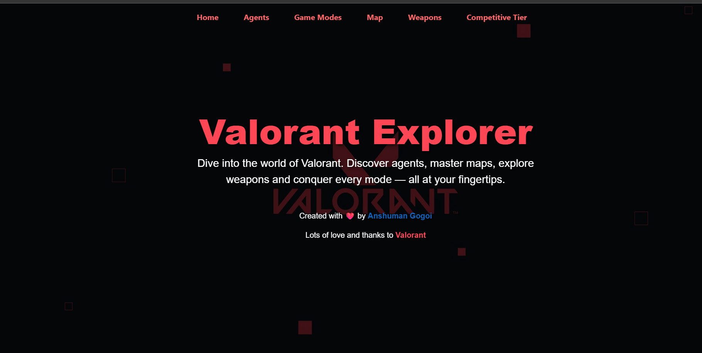
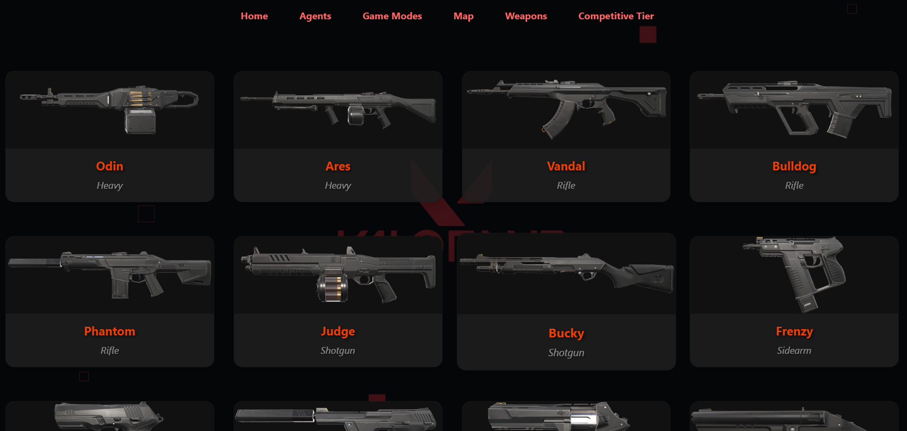
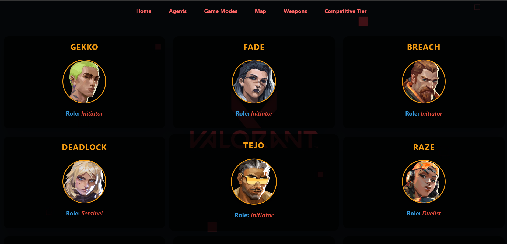
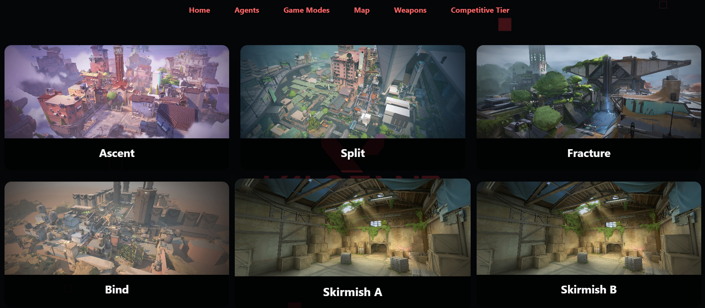

# 🎮 Valorant Accessories App

A modern frontend web application inspired by **Valorant**, designed to explore in-game content such as **Agents, Weapons, Maps, and Accessories** through a clean and responsive UI.

---

## 🌐 Live Demo

🔗 https://valorant-accessories-frontend.vercel.app/

---

## ✨ Overview

The Valorant Accessories App provides a visually rich interface for browsing Valorant-related content.  
It focuses on **UI clarity, smooth navigation, and component-based design**, making it ideal as a frontend portfolio project.

This project demonstrates:
- Clean React component structure
- Responsive layouts
- Game-themed UI design
- Scalable folder organization

---

## 📸 Screenshots

### 🏠 Home Page

### 🔫 Weapons

### 🧍 Agents

### 🗺 Maps

---

## 🚀 Features

- 🎮 Valorant-themed modern UI
- 🧍 Browse Agents with detailed visuals
- 🔫 Explore Weapons collection
- 🗺 View Maps with clean layout
- 📱 Fully responsive design
- ⚡ Fast and lightweight frontend

---

## 🛠 Tech Stack

- **React**
- **JavaScript (ES6+)**
- **HTML5**
- **CSS / Tailwind CSS**
- **Springboot**
- **Docker**
- **Vercel** (Deployment)

